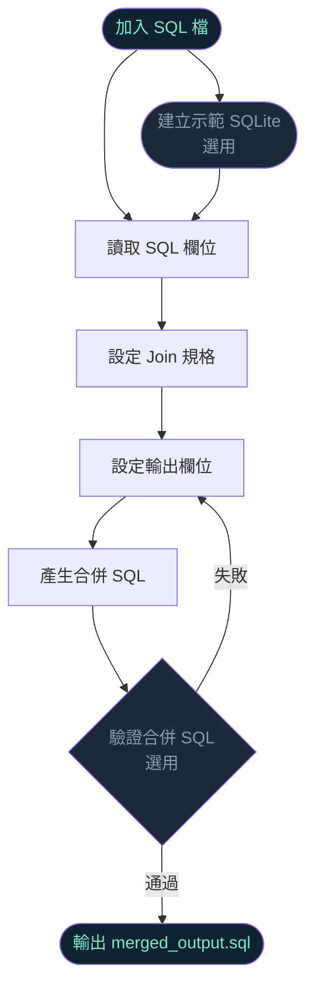
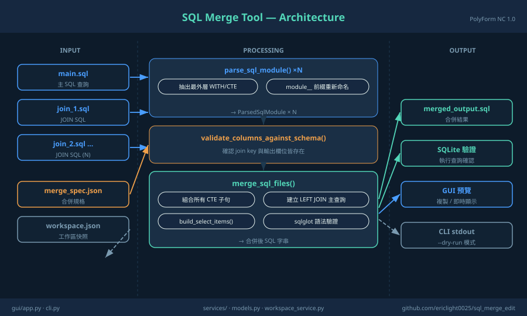
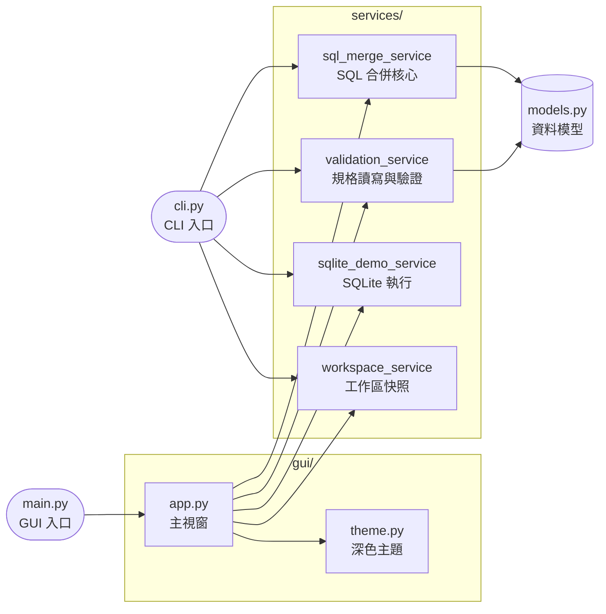
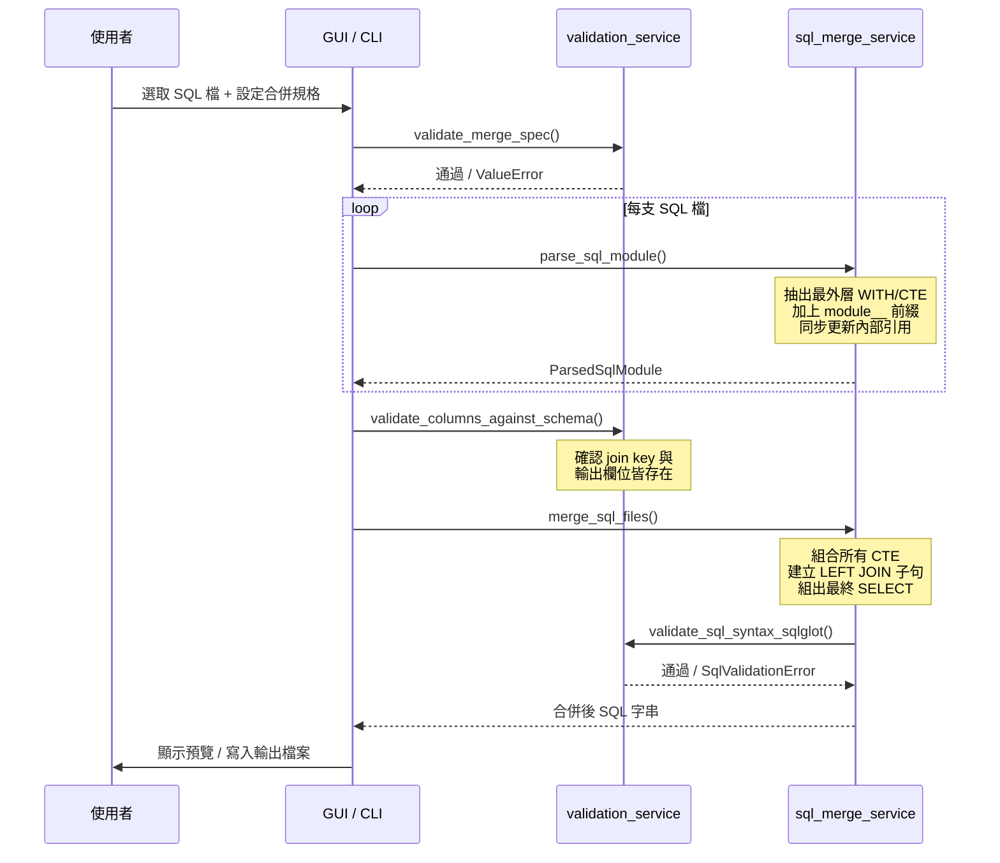

# SQL Merge Tool

將多支含 `WITH`/CTE 的 `.sql` 合併成單一 SQL，支援 LEFT JOIN 組合與 SQLite 語法驗證。

---

## 啟動 GUI

```bash
python main.py
```

---

## GUI 操作流程



工作區可透過「儲存工作區」/「載入工作區」保存與還原所有設定。

---

## 模組架構





---

## SQL 合併流程



---

## CLI 用法

```bash
# 基本用法（讀取資料夾內所有 .sql）
python -m sqlmerge_tool.cli --sql-dir sample_data/sample_sql --spec sample_data/merge_spec.json

# 指定個別檔案（可重複）
python -m sqlmerge_tool.cli \
  --sql sample_data/sample_sql/main.sql \
  --sql sample_data/sample_sql/sub.sql \
  --spec sample_data/merge_spec.json

# Dry-run：只驗證，不輸出檔案
python -m sqlmerge_tool.cli --sql-dir sample_data/sample_sql --spec sample_data/merge_spec.json --dry-run

# 建立示範 SQLite 並執行 SQLite 驗證
python -m sqlmerge_tool.cli \
  --sql-dir sample_data/sample_sql \
  --spec sample_data/merge_spec.json \
  --create-demo-db \
  --validate \
  --db sample_data/demo.sqlite

# 指定輸出路徑
python -m sqlmerge_tool.cli --sql-dir sample_data/sample_sql --spec sample_data/merge_spec.json --output result.sql
```

### CLI 參數說明

| 參數 | 說明 |
|------|------|
| `--sql-dir DIR` | SQL 檔案資料夾（與 `--sql` 互斥） |
| `--sql FILE` | 指定單支 SQL 檔案，可重複（與 `--sql-dir` 互斥） |
| `--spec FILE` | 合併規格 JSON 路徑 |
| `--output FILE` | 輸出路徑（預設: `merged_output.sql`） |
| `--db FILE` | SQLite 資料庫路徑（預設: `sample_data/demo.sqlite`） |
| `--create-demo-db` | 先建立示範 SQLite |
| `--validate` | 對 SQLite 執行驗證 |
| `--dry-run` | 只驗證，不寫入輸出檔案 |

---

## 執行測試

```bash
python -m pytest tests/ -q
```

---

## 目錄結構

```
sql_merge_edit/
├── main.py                          # GUI 入口
├── sqlmerge_tool/
│   ├── cli.py                       # CLI 入口
│   ├── models.py                    # 資料模型
│   ├── logging_config.py
│   ├── gui/
│   │   ├── app.py                   # 主視窗
│   │   └── theme.py                 # 深色主題設定
│   └── services/
│       ├── sql_merge_service.py     # SQL 合併核心
│       ├── validation_service.py    # 規格讀寫與驗證
│       ├── sqlite_demo_service.py   # SQLite 示範執行
│       └── workspace_service.py    # 工作區快照
├── sample_data/
│   ├── sample_sql/                  # 範例 SQL 檔案
│   ├── merge_spec.json              # 合併規格範例
│   └── demo.sqlite                  # 示範 SQLite
└── tests/                           # pytest 測試
```

---

## 已知限制

- 目前只支援 **LEFT JOIN**（MVP 階段）
- SQL 解析為自製 parser，不依賴 sqlglot；sqlglot 僅用於最終語法驗證（選用依賴）
- GUI 僅在 Windows / Linux 桌面環境測試（需要 `tkinter`）

---

## 授權

本專案採用 [PolyForm Noncommercial 1.0.0](LICENSE) 授權，禁止商業用途。
